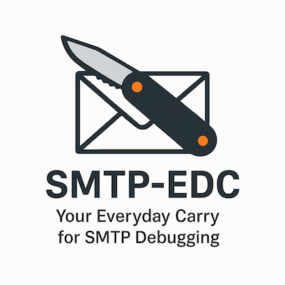

[](https://github.com/asachs01/smtp-edc/actions/workflows/release.yml)
[](https://goreportcard.com/report/github.com/asachs01/smtp-edc)
[](https://opensource.org/licenses/MIT)

# SMTP-EDC (SMTP Enhanced Diagnostics Client)

SMTP-EDC is a powerful, feature-rich SMTP testing tool written in Go, similar to SWAKS (SWiss Army Knife for SMTP). It provides both a command-line interface and a modern desktop application built with Wails for comprehensive SMTP server testing and email diagnostics.

## Features

### Core SMTP Testing
- **Multiple Authentication Methods**: PLAIN, LOGIN, CRAM-MD5, OAuth2
- **Comprehensive Connection Testing**: StartTLS, SSL/TLS, plain connections
- **Message Composition**: Text and HTML emails with attachment support
- **Template System**: Predefined message templates for testing scenarios
- **Advanced Diagnostics**: Detailed connection logs and error reporting
- **Rate Limiting**: Built-in protection against abuse
- **Security Features**: Credential management and secure storage

### User Interfaces
1. **Command Line Interface (CLI)**: Traditional terminal-based interface for automation and scripting
2. **Desktop GUI**: Modern cross-platform desktop application built with Wails v2 and React/TypeScript

## Installation

### Using Homebrew

```bash
# Add the tap
brew tap asachs01/smtp-edc

# Install SMTP-EDC
brew install smtp-edc
```

### Using Go Install

```bash
go install github.com/asachs/smtp-edc/cmd/smtp-edc@latest
```

### From Source

```bash
git clone https://github.com/asachs/smtp-edc.git
cd smtp-edc
go build -o smtp-edc cmd/smtp-edc/main.go  # CLI version
```

### Building the Desktop Application
```bash
# Install Wails (if not already installed)
go install github.com/wailsapp/wails/v2/cmd/wails@latest

# Build the desktop application
wails build

# Or for development
wails dev
```

## Quick Start

### Command Line Usage
```bash
# Basic SMTP connection test
./smtp-edc -server smtp.gmail.com -port 587 -username your@email.com -password yourpassword

# Send a test email
./smtp-edc -server smtp.gmail.com -port 587 -username your@email.com -password yourpassword \\
  -from your@email.com -to recipient@example.com -subject "Test Email" -body "This is a test."

# Test with STARTTLS
./smtp-edc -server smtp.gmail.com -port 587 -starttls -username your@email.com -password yourpassword
```

### Desktop Application
1. Launch the application: `./smtp-edc-ui` (or use `wails dev` for development)
2. Configure your SMTP connection settings
3. Compose and send test messages
4. View detailed connection logs and diagnostics

## Configuration

SMTP-EDC supports configuration via:
- Command line flags
- YAML configuration files
- Environment variables
- GUI settings (desktop application)

### Example Configuration File
```yaml
server: smtp.gmail.com
port: 587
username: your@email.com
password: yourpassword
auth_type: PLAIN
starttls: true
skip_verify: false
templates:
  test: "This is a test email from SMTP-EDC"
```

## Project Structure

```
smtp-edc/
├── cmd/smtp-edc/           # CLI application entry point
├── main.go                 # Wails desktop application entry point
├── app.go                  # Wails backend service layer
├── frontend/               # React/TypeScript frontend for desktop app
├── internal/
│   ├── auth/              # Authentication implementations
│   ├── client/            # SMTP client logic
│   ├── config/            # Configuration management
│   ├── message/           # Message composition and templates
│   └── security/          # Security and logging features
├── docs/                  # Comprehensive documentation
└── wails.json            # Wails project configuration
```

## Development

### Prerequisites
- Go 1.21+
- Node.js 16+ (for desktop app frontend)
- Wails v2 (for desktop app development)

### Development Workflow
```bash
# Install dependencies
go mod download
cd frontend && npm install

# Run desktop app in development mode
wails dev

# Build for production
wails build

# Run tests
go test ./...
```

### Color Theme
The desktop application uses a carefully chosen color palette:
- **Primary**: #FFFFFF (White)
- **Secondary**: #253238 (Dark Gray-Blue)
- **Accent**: #FF7C1A (Orange)

## Documentation

Comprehensive documentation is available in the `docs/` directory:
- [Wails UI Conversion Plan](docs/WAILS_UI_CONVERSION_PLAN.md)
- [Product Requirements Document](docs/WAILS_UI_PRD.md)
- [SMTP Security Guide](docs/SMTP_SECURITY_GUIDE.md)
- [Troubleshooting Guide](docs/TROUBLESHOOTING_GUIDE.md)
- [Comprehensive README](docs/COMPREHENSIVE_README.md)

## Contributing

1. Fork the repository
2. Create a feature branch (`git checkout -b feature/amazing-feature`)
3. Commit your changes (`git commit -m 'Add some amazing feature'`)
4. Push to the branch (`git push origin feature/amazing-feature`)
5. Open a Pull Request

## License

This project is licensed under the MIT License - see the [LICENSE](LICENSE) file for details.

## Comparison with SWAKS

SMTP-EDC provides similar functionality to SWAKS with several enhancements:
- Modern Go implementation with better performance
- Cross-platform desktop GUI
- Enhanced authentication support including OAuth2
- Built-in security features and rate limiting
- Comprehensive logging and diagnostics
- Template system for common testing scenarios

## Roadmap

- [ ] Enhanced OAuth2 support for major email providers
- [ ] Advanced message templates and scripting
- [ ] Bulk email testing capabilities
- [ ] REST API for automation
- [ ] Docker containerization
- [ ] Package managers distribution (Homebrew, Chocolatey, etc.)

## Support

For issues, feature requests, or questions:
- Open an issue on GitHub
- Check the [Troubleshooting Guide](docs/TROUBLESHOOTING_GUIDE.md)
- Review the comprehensive documentation

# Homebrew Tap for SMTP-EDC

This repository contains the Homebrew formula for [SMTP-EDC](https://github.com/asachs01/smtp-edc), a powerful, cross-platform SMTP testing tool written in Go.

## Installation

```bash
# Add the tap
brew tap asachs01/smtp-edc

# Install SMTP-EDC
brew install smtp-edc
```

## Usage

After installation, you can use SMTP-EDC from the command line:

```bash
# Basic usage
smtp-edc --server smtp.example.com --from sender@example.com --to recipient@example.com

# With authentication
smtp-edc --server smtp.example.com --port 587 --from sender@example.com --to recipient@example.com \
    --auth plain --username user --password pass

# With TLS/STARTTLS
smtp-edc --server smtp.example.com --port 587 --from sender@example.com --to recipient@example.com \
    --starttls

# With debug mode
smtp-edc --server smtp.example.com --from sender@example.com --to recipient@example.com --debug
```

For more detailed usage information, visit the [SMTP-EDC documentation](https://github.com/asachs01/smtp-edc#readme).

## Updating

To update SMTP-EDC to the latest version:

```bash
brew update
brew upgrade smtp-edc
```

## Troubleshooting

If you encounter any issues:

1. Try updating the tap:
   ```bash
   brew update
   brew upgrade smtp-edc
   ```

2. Check the [SMTP-EDC issues](https://github.com/asachs01/smtp-edc/issues) page
3. Create a new issue if needed

## Development

This tap is automatically updated when new releases are published to the main SMTP-EDC repository. The update process is handled by GitHub Actions.

### Manual Formula Updates

If you need to update the formula manually:

1. Get the SHA256 of the new release tarball:
   ```bash
   curl -L https://github.com/asachs01/smtp-edc/archive/refs/tags/vX.Y.Z.tar.gz | shasum -a 256
   ```

2. Update the formula in `Formula/smtp-edc.rb` with:
   - New version number
   - New SHA256
   - New URL

## License

This tap is distributed under the [MIT License](LICENSE).
