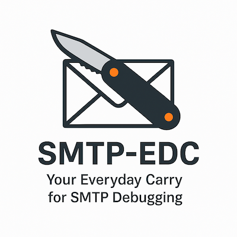

[](https://github.com/asachs01/smtp-edc/actions/workflows/release.yml)
[](https://goreportcard.com/report/github.com/asachs01/smtp-edc)
[](https://opensource.org/licenses/MIT)

# SMTP-EDC

A powerful, cross-platform SMTP testing tool written in Go, designed to be a modern alternative to Swaks. SMTP-EDC provides comprehensive SMTP testing capabilities with a focus on ease of use and detailed debugging information.

## 🚀 Features

- **SMTP Testing**
  - Basic SMTP transaction testing
  - Support for multiple authentication methods (PLAIN, LOGIN, CRAM-MD5)
  - TLS/STARTTLS support with configurable security options
  - Custom headers and MIME support
  - Attachment handling

- **Debugging & Analysis**
  - Detailed protocol interaction logging
  - Verbose mode for transaction details
  - Debug mode for low-level protocol analysis
  - Error reporting with context

- **Cross-Platform**
  - Native support for Windows, macOS, and Linux
  - Consistent behavior across platforms
  - No external dependencies

## 📦 Installation

### Using Go Install

```bash
go install github.com/asachs/smtp-edc/cmd/smtp-edc@latest
```

### From Source

```bash
git clone https://github.com/asachs/smtp-edc.git
cd smtp-edc
go build -o smtp-edc cmd/smtp-edc/main.go
```

## 🛠️ Usage

### Basic Email Test

```bash
smtp-edc --server smtp.example.com \
         --from sender@example.com \
         --to recipient@example.com \
         --subject "Test Email" \
         --body "This is a test email"
```

### With Authentication

```bash
smtp-edc --server smtp.example.com \
         --port 587 \
         --from sender@example.com \
         --to recipient@example.com \
         --auth plain \
         --username user \
         --password pass
```

### With TLS/STARTTLS

```bash
smtp-edc --server smtp.example.com \
         --port 587 \
         --from sender@example.com \
         --to recipient@example.com \
         --starttls \
         --skip-verify  # Skip certificate verification (not recommended for production)
```

### With Attachments

```bash
smtp-edc --server smtp.example.com \
         --from sender@example.com \
         --to recipient@example.com \
         --attach /path/to/file1.txt \
         --attach /path/to/file2.pdf
```

### Debug Mode

```bash
smtp-edc --server smtp.example.com \
         --from sender@example.com \
         --to recipient@example.com \
         --debug
```

## ⚙️ Configuration

SMTP-EDC can be configured using command-line arguments or a configuration file (`smtp-edc.yaml`). The configuration file supports all command-line options in YAML format.

Example configuration file:

```yaml
server: smtp.example.com
port: 587
from: sender@example.com
to:
  - recipient1@example.com
  - recipient2@example.com
auth_type: plain
username: user
password: pass
starttls: true
skip_verify: false
templates:
  welcome: |
    Dear {{.Name}},
    Welcome to our service!
```

## 🔍 Troubleshooting

### Common Issues

1. **Connection Refused**
   - Verify the server address and port
   - Check firewall settings
   - Ensure the SMTP server is running

2. **Authentication Failed**
   - Verify username and password
   - Check if the correct authentication method is used
   - Ensure the account is not locked

3. **TLS Handshake Failed**
   - Check if STARTTLS is supported by the server
   - Verify certificate validity
   - Try with `--skip-verify` for testing

### Debugging Tips

- Use `--verbose` for detailed transaction information
- Use `--debug` for protocol-level debugging
- Check server logs for additional context

## 🏗️ Project Structure

```
smtp-edc/
├── cmd/
│   └── smtp-edc/          # Main application entry point
│       └── main.go
├── internal/
│   ├── client/            # SMTP client implementation
│   ├── message/           # Email message handling
│   ├── auth/              # Authentication methods
│   └── transport/         # Network transport layer
├── pkg/
│   ├── smtp/              # SMTP protocol implementation
│   └── utils/             # Utility functions
├── docs/                  # Documentation
├── scripts/               # Build and deployment scripts
└── plans/                 # Project planning documents
```

## 📝 Contributing

We welcome contributions! Please follow these steps:

1. Fork the repository
2. Create a feature branch
3. Commit your changes
4. Push to the branch
5. Create a Pull Request

### Development Setup

```bash
git clone https://github.com/asachs/smtp-edc.git
cd smtp-edc
go mod download
go test ./...
```

## 📄 License

This project is licensed under the MIT License - see the [LICENSE](LICENSE) file for details.

## 🙏 Acknowledgments

- Inspired by Swaks
- Built with Go
- Community contributions

## 📞 Support

For support, please:
- Check the [issues](https://github.com/asachs/smtp-edc/issues) page
- Create a new issue if needed

# Homebrew Tap for SMTP-EDC

This repository contains the Homebrew formula for [SMTP-EDC](https://github.com/asachs01/smtp-edc), a powerful, cross-platform SMTP testing tool written in Go.

## Installation

```bash
# Add the tap
brew tap asachs01/smtp-edc

# Install SMTP-EDC
brew install smtp-edc
```

## Usage

After installation, you can use SMTP-EDC from the command line:

```bash
# Basic usage
smtp-edc --server smtp.example.com --from sender@example.com --to recipient@example.com

# With authentication
smtp-edc --server smtp.example.com --port 587 --from sender@example.com --to recipient@example.com \
    --auth plain --username user --password pass

# With TLS/STARTTLS
smtp-edc --server smtp.example.com --port 587 --from sender@example.com --to recipient@example.com \
    --starttls

# With debug mode
smtp-edc --server smtp.example.com --from sender@example.com --to recipient@example.com --debug
```

For more detailed usage information, visit the [SMTP-EDC documentation](https://github.com/asachs01/smtp-edc#readme).

## Updating

To update SMTP-EDC to the latest version:

```bash
brew update
brew upgrade smtp-edc
```

## Troubleshooting

If you encounter any issues:

1. Try updating the tap:
   ```bash
   brew update
   brew upgrade smtp-edc
   ```

2. Check the [SMTP-EDC issues](https://github.com/asachs01/smtp-edc/issues) page
3. Create a new issue if needed

## Development

This tap is automatically updated when new releases are published to the main SMTP-EDC repository. The update process is handled by GitHub Actions.

### Manual Formula Updates

If you need to update the formula manually:

1. Get the SHA256 of the new release tarball:
   ```bash
   curl -L https://github.com/asachs01/smtp-edc/archive/refs/tags/vX.Y.Z.tar.gz | shasum -a 256
   ```

2. Update the formula in `Formula/smtp-edc.rb` with:
   - New version number
   - New SHA256
   - New URL

## License

This tap is distributed under the [MIT License](LICENSE).
